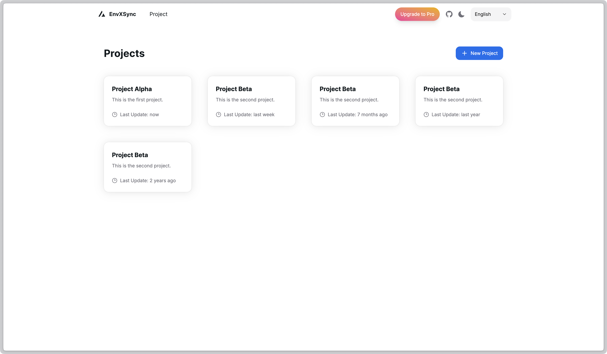
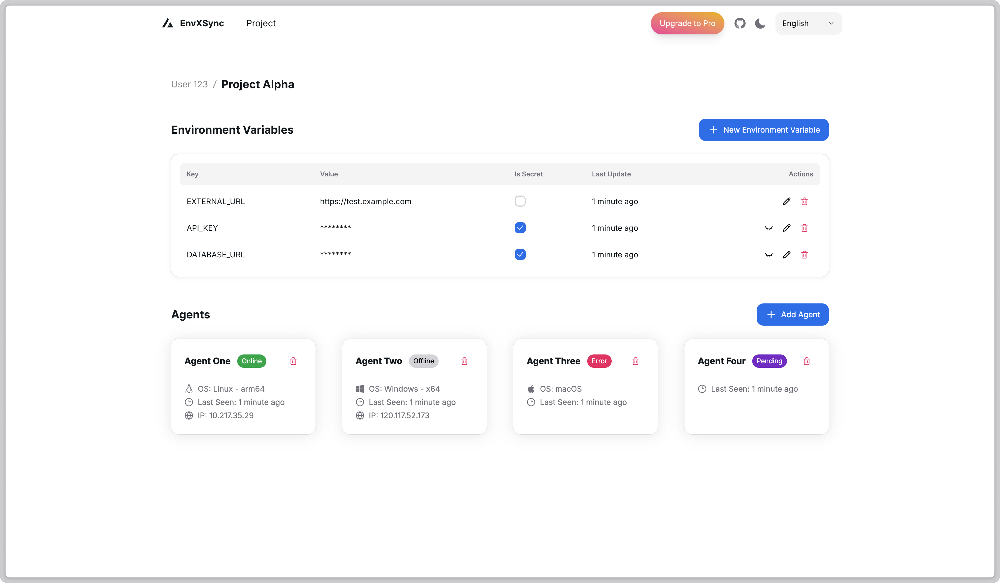

<h1 align="center">EnvXSync</h1>

Maintain environment variables easily across multiple servers.

> [!WARNING]
> This project is currently in very early beta. Use at your own risk.

## Features
- Centralized management of environment variables.
- Secure storage and transmission of sensitive data.
- Easy synchronization across multiple servers.
- User-friendly web interface for managing variables.
- Role-based access control for enhanced security.
- Audit logs to track changes and access.
- Internationalization support for multiple languages.

## Screenshots
| Dashboard | Variable Management |
|-----------|---------------------|
|  |  |

## Installation

Comming soon...

## Development
* [Frontend](./frontend/README.md)
* [Backend](./backend/README.md)
* [Agent](./agent/README.md)
