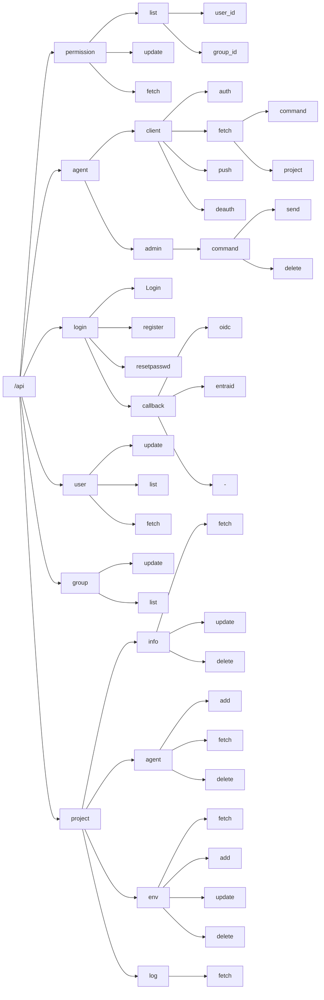

```mermaid
graph LR
    A["/api"]
    
    A --> B["permission"]
    B --> B1["list"]
    B1 --> B1a["user_id"]
    B1 --> B1b["group_id"]
    B --> B2["update"]
    B --> B3["fetch"]

    A --> C["agent"]
    C --> C1["client"]
    C1 --> C1a["auth"]
    C1 --> C1b["fetch"]
    C1b --> C1b1["command"]
    C1b --> C1b2["project"]
    C1 --> C1c["push"]
    C1 --> C1d["deauth"]
    C --> C2["admin"]
    C2 --> C2a["command"]
    C2a --> C2a1["send"]
    C2a --> C2a2["delete"]

    A --> D["login"]
    D --> D1["Login"]
    D --> D2["register"]
    D --> D3["resetpasswd"]
    D --> D4["callback"]
    D4 --> D4a["oidc"]
    D4 --> D4b["entraid"]
    D4 --> D4c["-"]

    A --> E["user"]
    E --> E1["update"]
    E --> E2["list"]
    E --> E3["fetch"]

    A --> F["group"]
    F --> F1["update"]
    F --> F2["list"]

    A --> G["project"]
    G --> G1["info"]
    G1 --> G1a["fetch"]
    G1 --> G1b["update"]
    G1 --> G1c["delete"]
    G --> G2["agent"]
    G2 --> G2a["add"]
    G2 --> G2b["fetch"]
    G2 --> G2c["delete"]
    G --> G3["env"]
    G3 --> G3a["fetch"]
    G3 --> G3b["add"]
    G3 --> G3c["update"]
    G3 --> G3d["delete"]
    G --> G4["log"]
    G4 --> G4a["fetch"]
```